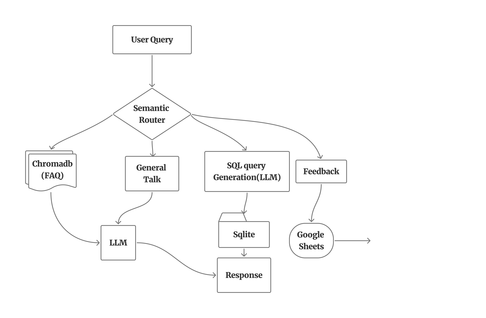

# E-Commerce-Chatbot


An E-commerce chat assistant that can help users in their shopping, handling common FAQs queries accurately by identifying the user intent using semantic router. Integrated with ChromaDb and Sqlite with LLM to provide source grounded correct answers.

Currently, supports product queries for women shoes only. 

This chatbot currently supports three intents:
- **Faq**: Triggered when users ask questions related to the platform's policies or general information. eg, Is online payment available?
- **Sql**: Activated when users request product listings or information based on real-time database queries. eg, Show me all nike shoes below Rs. 3000.
- **General Talk**: Begin when user asks general questions about the bot or welcoming the user. eg, Hello, What do you do?

## Architecture


## Folder Structure
```text
E_commerce_Chat_Assistant/
│
├── app/                                # Main application logic
│   ├── faq.py                          # FAQ handling 
│   ├── google_sheet.py                 # Feedback Collection into sheets
│   ├── router.py                       # Semantic intent router
│   ├── main.py                         # Streamlit app entry point
│   ├── smalltalk.py                    # Small talk response 
│   ├── sql.py                          # SQL-based product search
│   └── resources/                      # Data files for ingestion
│       ├── chatbot_flow.png            # Flow Diagram of Project
│       ├── faq_data.csv                # Frequently asked questions dataset
│       └── db.sqlite                   # SQLite product database
├── web-scraping/                       # E-commerce product scrapers and tools
│   ├── csv_to_sqlite.py                # Convert scraped CSV data to SQLite
│   └── flipkart_data_extraction.ipynb  # Flipkart scraping notebook
│
├── .gitignore                          # Files to be ignored
├── LICENSE                             # Apache License file
├── README.md                           # This documentation
└── requirements.txt                    # Python dependencies

```

### Set-up & Execution
1. Clone the repository
   ```bash
   git clone https://github.com/itsmoksh/E-Commerce-Chatbot.git
   ```
2. Run the following command to install all dependencies. 

    ```bash
    pip install -r app/requirements.txt
    ```

3. Generate your Google sheets credentials for recording feedbacks.
   Follow below steps:
   - Go to google cloud console with the valid email id, and create a new project.
   - Select that project, search google sheets api and enable it. 
   - Under 'Enable API & Services' click on Create credentials and choose application data.
   - Enter your service account name, then grant editor permission to that project, and click on done.
   - Your service account is created. Just go to credentials select the service account. 
   - Under keys create a new api key and save it as json.

4. Inside app folder, create a .env file with your GROQ credentials as follows:
    ```text
    GROQ_MODEL=<Add the model name, e.g. llama-3.3-70b-versatile>
    GROQ_API_KEY=<Add your groq api key here>
    GOOGLE_SHEETS_CREDENTIALS = <Put your google sheets json credentials into a single line e.g. {"type":.......,"unviverse_domain":..}
    GOOGLE_SHEETS_ID = <Create a new google sheets and put it's sheet id here>
   ```
   Note: All the credentials should be enclosed in strings, like GROQ_API_KEY= 'gs...'

5. Run the streamlit app by running the following command.

    ```bash
    streamlit run app/main.py
    ```

**Streamlit Live Demo:** [E-Commerce Chatbot](https://moksh-e-commerce-chatbot.streamlit.app/)
